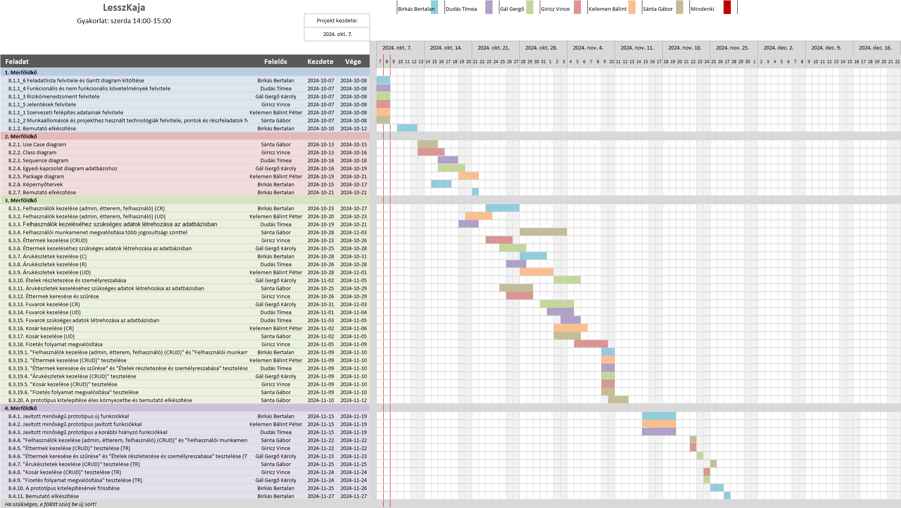

# LesszKaja Projektterv 2024

## 1. Összefoglaló 

A sikeres ételkiszállítás csakis arról szól, hogy lesz étel a leggyorsabb, legmegbízhatóbb módon. 
Ahhoz hogy az emberek minél könnyebben elérjék az oldalt, illetve minél többen tudjanak csúcsidőben rendelni egy robosztus skálázható oldalra van szükség, mely ki tudja szolgálni a megrendelőket, illetve a futárokat.
Az átláthatóság érdekében megfelelő felülettel kell rendelkezni, mind a felhasználók, adminok, illetve futárok számára szükséges oldalakon, a munkafolyamatokat, illetve megrendelések folyamatát könnyítve.
Projektünk célja az eddig felvázolt optimális ételkiszállító webalkalmazás megalkotása az ebéd/ételszállító cégeknek, mely megvalósítja ezeket, illetve a bonyolult régimódi munkaelosztásokat és rendeléseket leváltja.

## 2. A projekt bemutatása

Ez a projektterv a Lesszkaja projektet mutatja be, amely 2024-10-05-től 2024-12-04-ig tart, azaz összesen 60 napon keresztül fog futni. A projekten hat fejlesztő fog dolgozni, az elvégzett feladatokat pedig négy alkalommal fogjuk prezentálni a megrendelőnek, annak érdekében, hogy biztosítsuk a projekt folyamatos előrehaladását.

### 2.1. Rendszerspecifikáció

A rendszernek tudnia kell kezelnie a különböző éttermeket, azok tulajdonosainak biztosítania kell egy felületet ahol módosítani tudják éttermük adatait, illetve az általuk forgalmazott ételeket, ezen felül nyomon követhetik és feltölhetik árukészletüket. A futároknak biztosítania kell, hogy a megrendeléseket meg tudják tekinteni és azokat el tudják fogadni. A különböző felhasználóknak biztosítani kell az éttermekre való szűrést, a rendelések felvételét, bizonyos szinten az éttermek által beállított opciókkal ezen rendelések tételeinek személyreszabását, saját kosaruk kezelését, azok kifizetését, illetve rendeléseik állapotának megtekintését. Emellett a vendég felhasználók kosarát is tudnia kell kezelni. Az admin felhasználóknak egy olyan felületet kell biztosítani, ahol a megvalósított elemeket módosíthatják.

### 2.2. Funkcionális követelmények

 - Felhasználók kezelése (admin, étterem, felhasználó) (CRUD):
    - Admin felhasználó: Az admin jogosult új felhasználók (pl. éttermek, vendégek) létrehozására, meglévő felhasználók adatainak módosítására, inaktiválására vagy törlésére.
    - Éttermek: Az éttermek kezelhetik saját profiljukat, menüjüket.
    - Felhasználók: A vendégek regisztrálhatnak, bejelentkezhetnek, és szerkeszthetik saját profiljukat (személyes adatok, szállítási címek).
    - Futár: A futárok felvehetnek rendeléseket, megtekinthetik a rendeléseik címét, összegét, és megerősíthetik azok átvételét.
 
 - Felhasználói munkamenet megvalósítása több jogosultsági szinttel:
    - A különböző típusú felhasználók (adminok, éttermek, vendégek) különböző hozzáférési szintekkel rendelkeznek, és a rendszer figyeli, hogy melyik felhasználó milyen szerepkörben van bejelentkezve.
    - Admin: Teljes hozzáférés az összes funkcióhoz és adatbázishoz.
    - Éttermi felhasználók: Korlátozott hozzáférés csak a saját éttermükhöz és menüjükhöz, valamint rendeléskezeléshez.
    - Vendégek: Csak saját profiljuk, rendeléseik és kosaruk elérésére jogosultak.
    - Futárok: Megtekinthetik az elérhető rendeléseket és felvehetik, majd teljesíthetik azokat, illetve a vendég felhasználók jogosultságaival is rendelkeznek.
 
 - Éttermek kezelése (CRUD):
    - Az adminok és éttermi felhasználók létrehozhatnak, megtekinthetnek, módosíthatnak és törölhetnek éttermi adatokat.
    - Létrehozás: Új éttermek felvétele a rendszerbe.
    - Lekérdezés: Éttermek adatainak megtekintése (pl. neve, címe, nyitvatartási idő, menüje).
    - Frissítés: Éttermek adatainak módosítása (pl. menü változtatása, árak frissítése).
    - Törlés: Nem aktív vagy bezárt éttermek eltávolítása a rendszerből.
 
 - Ételek részletezése és személyreszabása:
    - A felhasználók megtekinthetik az egyes ételek részletes adatait (pl. hozzávalók, tápanyagértékek, allergének).
    - Személyre szabás: A vendégek módosíthatják a rendeléseiket (pl. extra feltétek hozzáadása, összetevők eltávolítása).

 - Árukészletek kezelése (CRUD): Az éttermek követhetik és frissíthetik az árukészletüket.
    - Létrehozás: Új termékek hozzáadása az árukészlethez.
    - Lekérdezés: A jelenleg elérhető árukészlet lekérdezés.
    - Frissítés: Az árukészlet frissítése, ha új termékek érkeznek vagy bizonyos áruk kifogynak.
    - Törlés: Termékek eltávolítása a listából.

 - Kosár kezelése (CRUD)
    - Termékek hozzáadása a kosárhoz
    - Kosárban lévő termék módosítása (pl. pizza feltétek megváltoztatása, mennyiség módosítása)
    - Kosárban lévő termékek megtekintése
    - Termékek törlése a kosárból

 - Fizetési folyamat megvalósítása:
    - Kizárólag szimuláció!
    - Fizetési módok kiválasztása (pl. bankkártya, PayPal).
    - Tranzakció feldolgozása: Az árak összesítése.
    - Visszaigazolás: A sikeres fizetés után a felhasználó kap egy visszaigazolást a rendelésről és fizetésről.

### 2.3. Nem funkcionális követelmények

 - A kliens oldal böngészőfüggetlen legyen
 - Reszponzív megjelenés
 - Intuitív design kialakítása
 - Az érzékeny adatokat biztonságosan tároljuk
 - A legfrissebb technológiákat használja a rendszer

## 3. Költség- és erőforrás-szükségletek

Az erőforrásigényünk összesen 66 személynap, átlagosan 11 személynap/fő.

A rendelkezésünkre áll összesen 6 * 70 = 210 pont.

## 4. Szervezeti felépítés és felelősségmegosztás

A projekt megrendelője Pflanzer Tamás. A LesszKaja projektet a projektcsapat fogja végrehajtani, amely jelenleg hat fejlesztőből áll. A csapatban található tapasztalt, pályakezdő webprogramozó és önfejlesztő projektvezető is. A tapasztalt projekttagok több éve tanulnak az egyetemen, illetve több projekten vannak túl.
 - Birkás Bertalan (1 év egyetemi tapasztalat, több fullstack projekt)
 - Dudás Tímea (2 év egyetemi tapasztalat)
 - Gál Gergő Károly (2 év egyetemi tapasztalat)
 - Giricz Vince (1 év egyetemi tapasztalat)
 - Kelemen Bálint Péter (1 év egyetemi tapasztalat)
 - Sánta Gábor (1 év egyetemi tapasztalat)

### 4.1 Projektcsapat

A projekt a következő emberekből áll:

| Név                  | Pozíció          |   E-mail cím (stud-os)      |
|----------------------|------------------|-----------------------------|
| Birkás Bertalan      | Projektmenedzser | h347842@stud-u.szeged.hu    |
| Dudás Tímea          | Projekt tag      | h257330@stud.u-szeged.hu    |
| Gál Gergő Károly     | Projekt tag      | h260678@stud.u-szeged.hu    |
| Giricz Vince         | Projekt tag      | h356811@stud.u-szeged.hu    |
| Kelemen Bálint Péter | Projekt tag      | h365052@stud-u.szeged.hu    |
| Sánta Gábor          | Projekt tag      | h378228@stud-u.szeged.hu    |

## 5. A munka feltételei

### 5.1. Munkakörnyezet

A projekt a következő munkaállomásokat fogja használni a munka során:

- Munkaállomások: 5db Windows 10-es és 1db macOs operációs rendszer
- MacBook Pro laptop (CPU: Intel Core i5 1.4GHz, RAM: 8GB, GPU: Intel Iris Plus Graphics 645 1536 MB)
- Asztali számítógép (CPU: AMD Ryzen 7 2700X, RAM: 32GB RAM, GPU: RTX 3070)
- Asztali számítógép (CPU: Ryzen 5 5600, RAM: 32GB, GPU: Radeon RX 6650XT)
- Dell laptop (CPU: AMD Ryzen 5 5600H with Radeon Graphics, RAM: 16GB)
- Asztali számítógép (CPU: Intel Core i5-7200U 2.50GHz, RAM: 8GB, GPU: Intel HD Graphics 620)
- Dell laptop (CPU: 11th Gen Intel Core i7-11800H 2.3GHz, Ram: 16Gb, GPU: NVIDIA GeForce RTX 3050)

A projekt a következő technológiákat/szoftvereket fogja használni a munka során: 

- NodeJS backend technológia
- Visual Studio Code, Jetbrains IDE fejlesztési környezetek
- Tailwind CSS keretrendszer
- Figma tervezői platform
- MySQL adatbázis-kezelő
- Git verziókövető rendszer

### 5.2. Rizikómenedzsment

| Kockázat                                    | Leírás                                                                                                                                                                                     | Valószínűség | Hatás  |
|---------------------------------------------|--------------------------------------------------------------------------------------------------------------------------------------------------------------------------------------------|--------------|--------|
| Technikai problémák                         | Az eszközök vagy szoftverek meghibásodhatnak (pl. laptopok, internetkapcsolat, programok összeomlása), ami leállíthatja a munkát.                                                          | közepes      | közepes|
| Csapattagok közötti konfliktusok            | Különböző személyiségek vagy eltérő munkastílusok összeütközése belső feszültségeket okozhat.                                                                                              | kicsi        | közepes|
| Több projekt és ZH egyidejű kezelése        | A csoporttagok egyszerre több egyetemi projektet és ZH-t kezelnek, ami csökkentheti a projektben nyújtott teljesítményüket.                                                                | közepes      | erős   |
| Feladatok nem megfelelő priorizálása        | A csoporttagok nem megfelelően priorizálják a feladatokat, emiatt fontos részek elhanyagolódhatnak, míg kevésbé lényegesek előtérbe kerülhetnek.                                           | kicsi        | közepes|
| Váratlan baleset                            | Egy csoporttag balesetet szenvedhet (pl. közlekedési baleset, sportbaleset), ami miatt rövid vagy hosszabb ideig nem tud részt venni a munkában.                                           | kicsi        | erős   |
| Influenza vagy megfázás                     | Súlyosságtól függően hátráltatja vagy bizonyos esetekben teljes mértékben korlátozza a munkavégzőt, így az egész projektre kihatással van.                                                 | közepes      | közepes|

## 6. Jelentések

### 6.1. Munka menedzsment
A munkát Birkás Bertalan koordinálja. Fő feladatai közé tartozik a projekt ütemtervének elkészítése és követése, a csapattagok közötti koordináció, valamint a feladatok priorizálása. Továbbá biztosítja, hogy a projekt erőforrásai megfelelően legyenek kezelve, és minden mérföldkő időben teljesüljön.

### 6.2. Csoportgyűlések

A csapat a megbeszélt időpontokban ülésezik, amelyen a felmerült problémákat megbeszéljük, továbbá döntünk a feladatok kiosztásáról. A megbeszélés minden esetben dokumentálva van.

1. megbeszélés:
 - Időpont: 2024.10.07.
 - Mód: online
 - Résztvevők: Birkás Bertalan, Sánta Gábor, Kelemen Bálint Péter, Dudás Tímea, Gál Gergő Károly, Giricz Vince
 - Érintett témák: Ismerkedés, projekttéma kiválasztása, feladatok kiosztása

1. megbeszélés:
 - Időpont: 2024.10.07.
 - Mód: online
 - Résztvevők: Birkás Bertalan, Sánta Gábor, Kelemen Bálint Péter, Dudás Tímea, Gál Gergő Károly, Giricz Vince
 - Érintett témák: Ismerkedés, projekttéma kiválasztása, feladatok kiosztása

2. megbeszélés:
 - Időpont: 2024.10.15.
 - Mód: online - Discord
 - Résztvevők: Birkás Bertalan, Sánta Gábor, Kelemen Bálint Péter, Dudás Tímea, Gál Gergő Károly, Giricz Vince
 - Érintett témák: feladatok kiosztása és a továbbhaladásukkal kapcsolatos megbeszélés

### 6.3. Minőségbiztosítás

Az elkészült terveket a terveken nem dolgozó csapattársak közül átnézik, hogy megfelel-e a specifikációnak és az egyes diagramtípusok összhangban vannak-e egymással. A meglévő rendszerünk helyes működését a prototípusok bemutatása előtt a tesztelési dokumentumban leírtak végrehajtása alapján ellenőrizzük és összevetjük a specifikációval, hogy az elvárt eredményt kapjuk-e. További tesztelési lehetőségek: unit tesztek írása az egyes modulokhoz vagy a kód közös átnézése (code review) egy, a vizsgált modul programozásában nem résztvevő csapattaggal. Szoftverünk minőségét a végső leadás előtt javítani kell a rendszerünkre lefuttatott kódelemzés során kapott metrikaértékek és szabálysértések figyelembevételével.
Az alábbi lehetőségek vannak a szoftver megfelelő minőségének biztosítására:
- Specifikáció és tervek átnézése (kötelező)
- Teszttervek végrehajtása (kötelező)
- Unit tesztek írása (választható)
- Kód átnézése (választható)

### 6.4. Átadás, eredmények elfogadása

A projekt eredményeit a megrendelő, Pflanzer Tamás fogja elfogadni. A projektterven változásokat csak a megrendelő írásos engedélyével lehet tenni. A projekt eredményesnek bizonyul, ha specifikáció helyes és határidőn belül készül el. Az esetleges késések pontlevonást eredményeznek. 
Az elfogadás feltételeire és beadás formájára vonatkozó részletes leírás a következő honlapon olvasható: https://okt.inf.szte.hu/rf1/

### 6.5. Státuszjelentés

Minden mérföldkő leadásnál a projekten dolgozók jelentést tesznek a mérföldkőben végzett munkájukról a a megadott sablon alapján. A gyakorlatvezetővel folytatott csapatmegbeszéléseken a csapat áttekintik és felmérik az eredményeket és teendőket. Továbbá gazdálkodnak az erőforrásokkal és szükség esetén a megrendelővel egyeztetnek a projektterv módosításáról.

## 7. A munka tartalma

### 7.1. Tervezett szoftverfolyamat modell és architektúra

A csapat az agilis fejlesztési modellt választja, hogy rugalmasan alkalmazkodhasson a felhasználói visszajelzésekhez és a változó igényekhez. A projekt háromrétegű architektúrát alkalmaz, amely elkülöníti a felhasználói interfészt, az üzleti logikát és az adatkezelést, így biztosítva a rendszer skálázhatóságát és könnyebb karbantartását.

### 7.2. Átadandók és határidők

A főbb átadandók és határidők a projekt időtartama alatt a következők:

| Szállítandó |                 Neve                                                        |   Határideje  |
|:-----------:|:---------------------------------------------------------------------------:|:-------------:|
|      D1     |      Projektterv és Gantt chart, prezentáció, egyéni jelentés               |  2024-10-09   |
|    P1+D2    |      UML, adatbázis- és képernyőtervek, prezentáció, egyéni jelentés        |  2024-10-23   |
|    P1+D3    |      Prototípus I. és tesztelési dokumentáció, egyéni jelentés              |  2024-11-13   |
|    P2+D4    |      Prototípus II. és frissített tesztelési dokumentáció, egyéni jelentés  |  2024-12-04   |

## 8. Feladatlista

A következőkben a tervezett feladatok részletes összefoglalása található.

### 8.1. Projektterv (1. mérföldkő)

Ennek a feladatnak az a célja, hogy megvalósításhoz szükséges lépéseket, az erőforrásigényeket, az ütemezést, a felelősöket és a feladatok sorrendjét meghatározzuk, majd vizualizáljuk Gantt diagram segítségével.

Részfeladatai a következők:

___

#### 8.1.1_1 Szervezeti felépítés adatainak felvitele

Felelős: Kelemen Bálint Péter

Tartam:  1 nap

Erőforrásigény:  1 személynap/fő

___

#### 8.1.1_2 Munkaállomások és projekthez használt technológiák felvitele, pontok és részfeladatok felvitele

Felelős: Sánta Gábor

Tartma: 1 nap

Erőforrásigény: 1 személynap/fő

___

#### 8.1.1_3 Rizikómenedzsment felvitele

Felelős: Gál Gergő Károly

Tartma: 1 nap

Erőforrásigény: 1 személynap/fő

___

#### 8.1.1_4 Funkcionális és nem funkcionális követelmények felvitele

Felelős: Dudás Tímea

Tartma: 1 nap

Erőforrásigény: 1 személynap/fő

___

#### 8.1.1_5 Jelentések felvitele

Felelős: Giricz Vince

Tartma: 1 nap

Erőforrásigény: 1 személynap/fő

___

#### 8.1.1_6 Feladatlista felvitele és Gantt diagram kitöltése

Felelős: Birkás Bertalan

Tartma: 1 nap

Erőforrásigény: 0.5 személynap/fő

___

#### 8.1.2. Bemutató elkészítése

Felelős: Birkás Bertalan

Tartam:  1 nap

Erőforrásigény:  0.5 személynap

### 8.2. UML és adatbázis- és képernyőtervek (2. mérföldkő)

___

Ennek a feladatnak az a célja, hogy a rendszerarchitektúrát, az adatbázist és webalkalmazás kinézetét megtervezzük.

Részfeladatai a következők:

___

#### 8.2.1. Use Case diagram

Felelős: Sánta Gábor

Tartam:  3 nap

Erőforrásigény:  2 személynap

___

#### 8.2.2. Class diagram

Felelős: Giricz Vince

Tartam:  4 nap

Erőforrásigény:  2 személynap

___

#### 8.2.3. Sequence diagram

Felelős: Dudás Tímea

Tartam:  3 nap

Erőforrásigény:  2 személynap

___

#### 8.2.4. Egyed-kapcsolat diagram adatbázishoz

Felelős: Gál Gergő Károly

Tartam:  4 nap

Erőforrásigény:  2 személynap

___

#### 8.2.5. Package diagram

Felelős: Kelemen Bálint Péter

Tartam:  3 nap

Erőforrásigény:  2 személynap

___

#### 8.2.6. Képernyőtervek

Felelős: Birkás Bertalan

Tartam:  3 nap

Erőforrásigény:  1 személynap

___

#### 8.2.7. Bemutató elkészítése

Felelős: Birkás Bertalan

Tartam:  1 nap

Erőforrásigény:  0.5 személynap

___

### 8.3. Prototípus I. (3. mérföldkő)

Ennek a feladatnak az a célja, hogy egy működő prototípust hozzunk létre, ahol a vállalt funkcionális követelmények nagy része már prezentálható állapotban van. 

Részfeladatai a következők:

___

#### 8.3.1. Felhasználók kezelése (admin, étterem, felhasználó)  (CR)

Felelős: Birkás Bertalan

Tartam:  5 nap

Erőforrásigény:  2 személynap

 - >#### 8.3.1.1 Felhasználók létrehozása funkció
   >
   > Tartam:  2.5 nap
   >
   > Erőforrásigény:  1 személynap

 - >#### 8.3.1.2 Felhasználók lekérdezése funkció
   >
   > Tartam:  2.5 nap
   >
   > Erőforrásigény:  1 személynap

___

#### 8.3.2. Felhasználók kezelése (admin, étterem, felhasználó) (UD)

Felelős: Kelemen Bálint Péter

Tartam:  4 nap

Erőforrásigény:  2 személynap

 - >#### 8.3.2.1 Felhasználók módosítása funkció
   >
   > Tartam:  2 nap
   >
   > Erőforrásigény:  1 személynap

 - >#### 8.3.2.2 Felhasználók törlése funkció
   >
   > Tartam:  2 nap
   >
   > Erőforrásigény:  1 személynap

___

#### 8.3.3. Felhasználók kezeléséhez szükséges adatok létrehozása az adatbázisban

Felelős: Dudás Tímea

Tartam:  3 nap

Erőforrásigény:  1 személynap

___

#### 8.3.4. Felhasználói munkamenet megvalósítása több jogosultsági szinttel

Felelős: Sánta Gábor

Tartam:  6 nap

Erőforrásigény:  1 személynap

 - >#### 8.3.4.1 Felhasználói adatok betöltése funkció megvalósítása
   >
   > Tartam:  3 nap
   >
   > Erőforrásigény:  1 személynap

 - >#### 8.3.4.2 Felhasználói információk tárolása funkciók
   >
   > Tartam:  3 nap
   >
   > Erőforrásigény:  1 személynap

___

#### 8.3.5. Éttermek kezelése (CRUD)

Felelős: Giricz Vince

Tartam:  4 nap

Erőforrásigény:  1 személynap

 - >#### 8.3.5.1 Éttermek létrehozása funkció
   >
   > Tartam:  1 nap
   >
   > Erőforrásigény:  0.25 személynap

 - >#### 8.3.5.2 Éttermek lekérdezése funkció
   >
   > Tartam:  1 nap
   >
   > Erőforrásigény:  0.25 személynap

 - >#### 8.3.5.3 Éttermek módosítása funkció
   >
   > Tartam:  1 nap
   >
   > Erőforrásigény:  0.25 személynap

 - >#### 8.3.5.4 Éttermek törlése funkció
   >
   > Tartam:  1 nap
   >
   > Erőforrásigény:  0.25 személynap

___

#### 8.3.6. Éttermek kezeléséhez szükséges adatok létrehozása az adatbázisban

Felelős: Gál Gergő Károly

Tartam:  4 nap

Erőforrásigény:  1 személynap

___

#### 8.3.7. Árukészletek kezelése (C)

Felelős: Birkás Bertalan

Tartam:  4 nap

Erőforrásigény:  1 személynap

___

#### 8.3.8. Árukészletek kezelése (R)

Felelős: Dudás Tímea

Tartam:  3 nap

Erőforrásigény:  1 személynap

___

#### 8.3.9. Árukészletek kezelése (UD)

Felelős: Kelemen Bálint Péter

Tartam:  5 nap

Erőforrásigény:  1 személynap

 - >#### 8.3.9.1 Árukészletek módosítása
   >
   > Tartam:  2.5 nap
   >
   > Erőforrásigény:  0.5 személynap

 - >#### 8.3.9.2 Árukészletek törlése
   >
   > Tartam:  2.5 nap
   >
   > Erőforrásigény:  0.5 személynap

___

#### 8.3.10. Ételek részletezése és személyreszabása

Felelős: Gál Gergő Károly

Tartam:  4 nap

Erőforrásigény:  2 személynap

 - >#### 8.3.10.1 Ételek leírásának elkészítése
   >
   > Tartam:  2 nap
   >
   > Erőforrásigény:  1 személynap

 - >#### 8.3.10.2 Ételek személyreszabása funkció
   >
   > Tartam:  2 nap
   >
   > Erőforrásigény:  1 személynap

___

#### 8.3.11. Árukészletek kezeléséhez szükséges adatok létrehozása az adatbázisban

Felelős: Sánta Gábor

Tartam:  5 nap

Erőforrásigény:  1 személynap

___

#### 8.3.12. Éttermek keresése és szűrése

Felelős: Giricz Vince

Tartam:  4 nap

Erőforrásigény:  1 személynap

 - >#### 8.3.12.1 Ételek keresése funkció
   >
   > Tartam:  2 nap
   >
   > Erőforrásigény:  0.5 személynap

 - >#### 8.3.12.2 Ételek szűrése funkció
   >
   > Tartam:  2 nap
   >
   > Erőforrásigény:  0.5 személynap

___

#### 8.3.13. Fuvarok kezelése (CR)

Felelős: Gál Gergő Károly

Tartam:  4 nap

Erőforrásigény:  1 személynap

 - >#### 8.3.13.1 Fuvarok létrehozása
   >
   > Tartam:  2 nap
   >
   > Erőforrásigény:  0.5 személynap

 - >#### 8.3.13.2 Fuvarok lekérdezése
   >
   > Tartam:  2 nap
   >
   > Erőforrásigény:  0.5 személynap

___

#### 8.3.14. Fuvarok kezelése (UD)

Felelős: Dudás Tímea

Tartam:  4 nap

Erőforrásigény:  1 személynap

 - >#### 8.3.14.1 Fuvarok módosítása
   >
   > Tartam:  2 nap
   >
   > Erőforrásigény:  0.5 személynap

 - >#### 8.3.14.2 Fuvarok törlése
   >
   > Tartam:  2 nap
   >
   > Erőforrásigény:  0.5 személynap

___

#### 8.3.15. Fuvarok szükséges adatok létrehozása az adatbázisban

Felelős: Dudás Tímea

Tartam:  3 nap

Erőforrásigény:  1 személynap

___

#### 8.3.16. Kosár kezelése (CR)

Felelős: Kelemen Bálint Péter

Tartam:  5 nap

Erőforrásigény:  1 személynap

 - >#### 8.3.16.1 Kosár létrehozása
   >
   > Tartam:  2.5 nap
   >
   > Erőforrásigény:  0.5 személynap

 - >#### 8.3.16.2 Kosár lekérdezése
   >
   > Tartam:  2.5 nap
   >
   > Erőforrásigény:  0.5 személynap

___

#### 8.3.17. Kosár kezelése (UD)

Felelős: Sánta Gábor

Tartam:  4 nap

Erőforrásigény:  1 személynap

 - >#### 8.3.17.1 Kosár módosítása
   >
   > Tartam:  2 nap
   >
   > Erőforrásigény:  0.5 személynap

 - >#### 8.3.17.2 Kosár törlése
   >
   > Tartam:  2 nap
   >
   > Erőforrásigény:  0.5 személynap

___

#### 8.3.18. Fizetés folyamat megvalósítása

Felelős: Giricz Vince

Tartam:  5 nap

Erőforrásigény:  2 személynap

 - >#### 8.3.18.1 Fizetési mód kiválaszása funkció
   >
   > Tartam:  2.5 nap
   >
   > Erőforrásigény:  1 személynap

 - >#### 8.3.18.2 Fizetés funkció
   > Tartam:  2.5 nap
   >
   > Erőforrásigény:  1 személynap

___

#### 8.3.19.1. "Felhasználók kezelése (admin, étterem, felhasználó) (CRUD)" és "Felhasználói munkamenet megvalósítása több jogosultsági szinttel" tesztelése

Felelős: Birkás Bertalan

Tartam:  2 nap

Erőforrásigény:  2 személynap

___

#### 8.3.19.2. "Éttermek kezelése (CRUD)" tesztelése

Felelős: Kelemen Bálint Péter

Tartam:  2 nap

Erőforrásigény:  1 személynap

___

#### 8.3.19.3. "Éttermek keresése és szűrése" és "Ételek részletezése és személyreszabása" tesztelése

Felelős: Dudás Tímea

Tartam:  2 nap

Erőforrásigény:  1 személynap

___

#### 8.3.19.4. "Árukészletek kezelése (CRUD)" tesztelése

Felelős: Gál Gergő Károly

Tartam:  2 nap

Erőforrásigény:  1 személynap

___

#### 8.3.19.5. "Kosár kezelése (CRUD)" tesztelése

Felelős: Giricz Vince

Tartam:  2 nap

Erőforrásigény:  1 személynap

___

#### 8.3.19.6. "Fizetés folyamat megvalósítása" tesztelése

Felelős: Sánta Gábor

Tartam:  2 nap

Erőforrásigény:  1 személynap

___

#### 8.3.20. A prototípus kitelepítése éles környezetbe és bemutató elkészítése

Felelős: Sánta Gábor

Tartam:  1 nap

Erőforrásigény:  1 személynap

___

### 8.4. Prototípus II. (4. mérföldkő)

Ennek a feladatnak az a célja, hogy az előző mérföldkő hiányzó funkcióit pótoljuk, illetve a hibásan működő funkciókat és az esetlegesen felmerülő új funkciókat megvalósítsuk. Továbbá az alkalmazás alapos tesztelése is a mérföldkőben történik az előző mérföldkőben összeállított tesztesetek alapján.

Részfeladatai a következők:

___

#### 8.4.1. Javított minőségű prototípus új funkciókkal

Felelős: Birkás Bertalan

Tartam:  5 nap

Erőforrásigény:  2.5 személynap

- >#### 8.4.1.1 Prototípus funkciók áttekintése
   >
   > Tartam:  2.5 nap
   >
   > Erőforrásigény:  1 személynap

 - >#### 8.4.1.2 Új funkciók hozzáadása
   >
   > Tartam:  2.5 nap
   >
   > Erőforrásigény:  1.5 személynap

___

#### 8.4.2. Javított minőségű prototípus javított funkciókkal

Felelős: Kelemen Bálint Péter

Tartam:  5 nap

Erőforrásigény:  3 személynap

- >#### 8.4.2.1 Prototípus funkciók áttekintése
   >
   > Tartam:  2.5 nap
   >
   > Erőforrásigény:  1 személynap

 - >#### 8.4.2.2 Szükséges változtatások a funkciókban
   >
   > Tartam:  2.5 nap
   >
   > Erőforrásigény:  3 személynap

___

#### 8.4.3. Javított minőségű prototípus a korábbi hiányzó funkciókkal

Felelős: Dudás Tímea

Tartam:  5 nap

Erőforrásigény:  3 személynap

- >#### 8.4.3.1 Prototípus funkciók áttekintése
   >
   > Tartam:  2.5 nap
   >
   > Erőforrásigény:  1 személynap

 - >#### 8.4.3.2 Szükséges hiányzó funkciók hozzáadása
   >
   > Tartam:  2.5 nap
   >
   > Erőforrásigény:  2 személynap

___

#### 8.4.4. "Felhasználók kezelése (admin, étterem, felhasználó) (CRUD)" és "Felhasználói munkamenet megvalósítása több jogosultsági szinttel " tesztelése (TR)

Felelős: Sánta Gábor

Tartam:  1 nap

Erőforrásigény:  2 személynap

___

#### 8.4.5. "Éttermek kezelése (CRUD)" tesztelése (TR)

Felelős: Giricz Vince

Tartam:  1 nap

Erőforrásigény:  1 személynap

___

#### 8.4.6. "Éttermek keresése és szűrése" és "Ételek részletezése és személyreszabása" tesztelése (TR)

Felelős: Gál Gergő Károly

Tartam:  1 nap

Erőforrásigény:  2 személynap

___

#### 8.4.7. "Árukészletek kezelése (CRUD)" tesztelése (TR)

Felelős: Sánta Gábor

Tartam:  1 nap

Erőforrásigény:  1 személynap

___

#### 8.4.8. "Kosár kezelése (CRUD)" tesztelése (TR)

Felelős: Giricz Vince

Tartam:  1 nap

Erőforrásigény:  2 személynap

___

#### 8.4.9. "Fizetés folyamat megvalósítása" tesztelése (TR)

Felelős: Gál Gergő Károly

Tartam:  1 nap

Erőforrásigény:  1 személynap

___

#### 8.4.10. A prototípus kitelepítésének frissítése

Felelős: Birkás Bertalan

Tartam:  1 nap

Erőforrásigény:  0.5 személynap

___

#### 8.4.11. Bemutató elkészítése

Felelős: Birkás Bertalan

Tartam:  1 nap

Erőforrásigény:  0.5 személynap

## 9. Részletes időbeosztás

## 10. Projekt költségvetés

### 10.1. Részletes erőforrásigény (személynap)

| Név                  |   M1  |   M2  |   M3 |   M4  | Összesen |
|----------------------|-------|-------|------|-------|----------|
| Birkás Bertalan      |   1   |  1.5  |  5   |  3.5  |  11      |
| Dudás Tímea          |   1   |   2   |  5   |   3   |  11      |
| Gál Gergő Károly     |   1   |   2   |  5   |   3   |  11      |
| Giricz Vince         |   1   |   2   |  5   |   3   |  11      |
| Kelemen Bálint Péter |   1   |   2   |  5   |   3   |  11      |
| Sánta Gábor          |   1   |   2   |  5   |   3   |  11      |

### 10.2. Részletes feladatszámok

| Név                  |   M1  |   M2  |   M3 |   M4 | Összesen |
|----------------------|-------|-------|------|------|----------|
| Birkás Bertalan      |   2   |   2   |  3   |  3   |   10     |
| Dudás Tímea          |   1   |   1   |  5   |  1   |   8      |
| Gál Gergő Károly     |   1   |   1   |  4   |  2   |   8      |
| Giricz Vince         |   1   |   1   |  4   |  2   |   8      |
| Kelemen Bálint Péter |   1   |   1   |  4   |  1   |   7      |
| Sánta Gábor          |   1   |   1   |  5   |  2   |   9      |

### 10.3. Részletes költségvetés

| Név                                 | M1      | M2       | M3       | M4       | Összesen  |
|-------------------------------------|---------|----------|----------|----------|-----------|
| Maximálisan megszerezhető pontszám  |  (7)    | (20)     | (35)     |  (28)    | 100% (70) |
| Birkás Bertalan                     | 6       |   10     |   32     |    22    | 70        |
| Dudás Tímea                         | 6       |   13     |   32     |    19    | 70        |
| Gál Gergő                           | 6       |   13     |   32     |    19    | 70        |
| Giricz Vince                        | 6       |   13     |   32     |    19    | 70        |
| Kelemen Bálint                      | 6       |   13     |   32     |    19    | 70        |
| Sánta Gábor                         | 6       |   13     |   32     |    19    | 70        |

Szeged, 2024-10-8.
