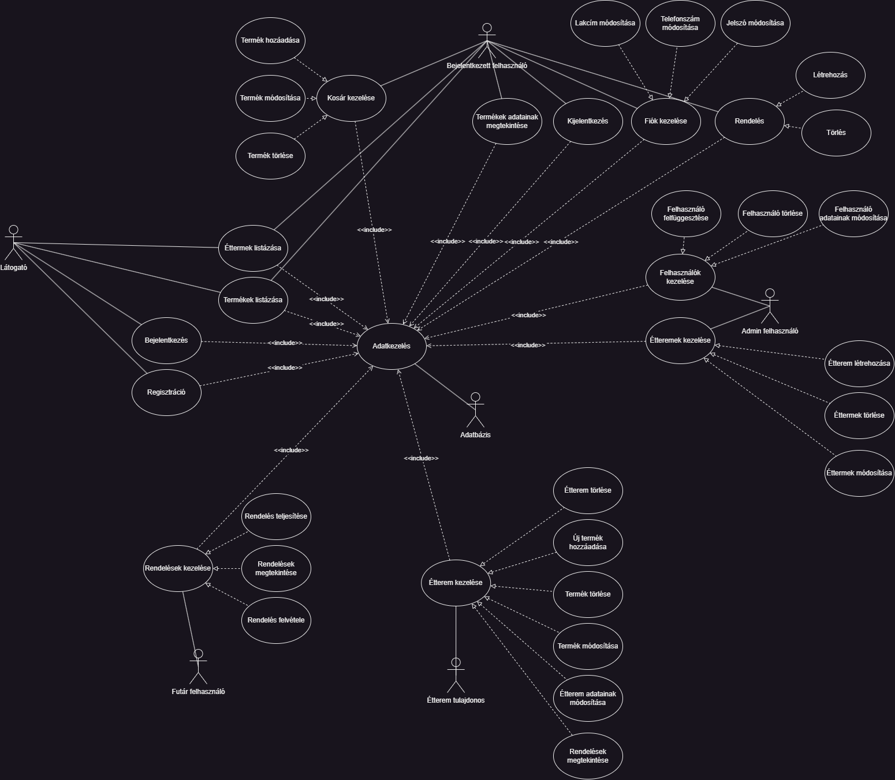

# Use case diagram
## Vázlat

Minden felhasználó
- Termékek listázása
- Kosár kezelése (hozzáadás, törlés, módosítás)

Étterem tulajdonos
- Termékek kezelése (törlés, módosítás, hozzáadás, listázás)

Admin
- Felhasználók kezelése (törlés, adatmódosítás)
-Éttermek kezelése (törlés, módosítás, létrehozás)

Futár
- Rendelések kezelése (felvétel, leadás, listázás)

Vendég
- Fiók adatainak módosítása
- Termék vásárlása

Látogató (nem bejelentkezett)
- Regisztráció
- Bejelentkezés

## Diagram
